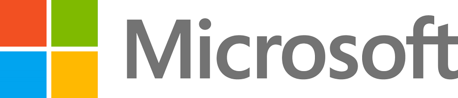
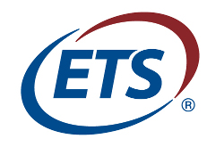
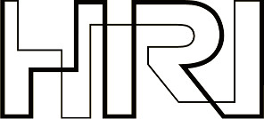
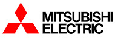
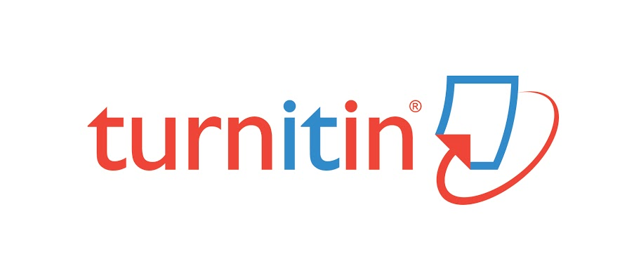
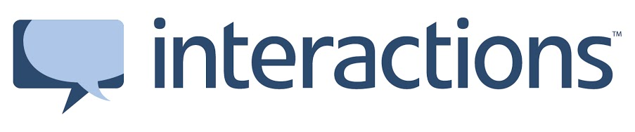

# We thank our sponsors

## Platinum Level

[Microsoft](http://research.microsoft.com/)

## Gold Level

[ETS](http://www.ets.org/)

[Amazon](http://www.amazon.com/speech)

## Silver Level

[Honda Research Institute](http://www.honda-ri.com/)

[Mitsubishi Electric Research Laboratories](http://www.merl.com/)

[Turnitin](http://turnitin.com/)

## Bronze Level

[Interactions](http://www.interactions.net/)

## Sponsor the Conference

SIGDIAL 2015 has a variety of opportunities for sponsors.

If you are interested in being a sponsor of SIGDIAL 2015, please contact Kristy Boyer, sponsorships chair, at sponsor-chair[at]sigdial.org.
